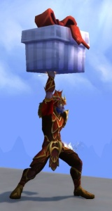

# HappyToolkit

This is a World of Warcraft addon that collect your toys and items, use them anytime without searching it.

### Usage
- You can use the command `/click ToggleHappyToolkitGUIButton` to toggle the window state.
- You can also set a keybinding in the keybinding settings to toggle the window state.

### TODO:
1. Add more useful toys and items.
2. Support for players to manually add toys and items.
3. Hide the button if the button can not used.

### Known Bugs:
1. There is a lag when hovering the mouse over the icons.
3. Scroll bar position is incorrect.

### Logo Attribution
- **Logo Source**: The logo is sourced from [wowhead](https://www.wowhead.com/item=151351/glowing-gift).

If you have any suggestions or discover any bugs, please raise them in the issues.
